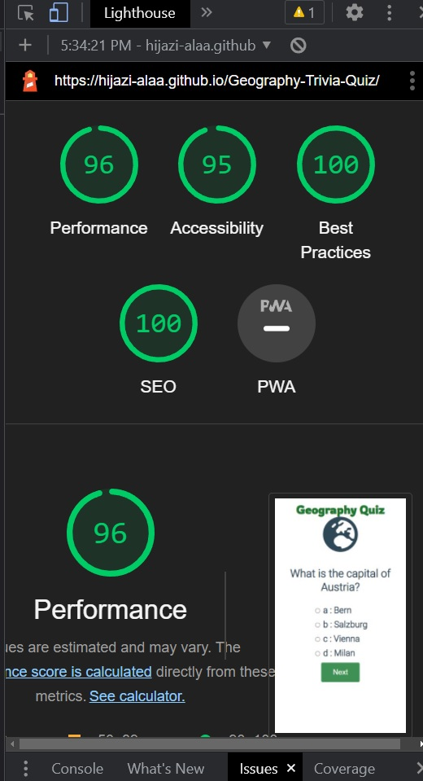

# Geography Quiz

[Geography Quiz](https://hijazi-alaa.github.io/Geography-Trivia-Quiz/)

This project is a small trivial Quiz to test the user's Geographical knowledge! It is simple and fun, answer 12 questions and get your results after submitting!
For Geography buffs and just users looking for a quick fun quiz, the site is a fun quiz.

The site was created using HTML, CSS and Java Script!

## Features

The Geography Quiz has 12 question, with a slide created using Java Script, Users Would be able to navigate Questions with next and previous buttons, each question has 4 different alternative answers only one of them is the right answer. after answering all the questions, users can submit their answers and get the results.

the site is responsive, and will work on large and small screen sizes with no problem with great user expeience.

It is very possiable to add as many questions as needed using java script  list of objects containing all the questions.

## testing

The site was tested using Google Chrome, internet explorer and Mozilla Firefox, and everything worked as intended on all 3 browsers

 
Java Script

Testing using JShint validator:
Metrics
There are 8 functions in this file.

Function with the largest signature take 2 arguments, while the median is 0.

Largest function has 18 statements in it, while the median is 4.

The most complex function has a cyclomatic complexity value of 3 while the median is 1
 

HTML

Testing using W3C validator:
when tested using W3C validator i got a warning stating that:
Section lacks heading. Consider adding h2-h6 elements to the section.
 

CSS

Testing using (jigsaw) validator:
no erros found.

Report generated using Google Chrome developer tools:  light house

## Deployment

The site is deployed on github pages by following these steps:

<li>In the github repository, navigated to the settings tab</li>
<li>In the settings tab navigated to the pages tab</li>
<li>Within the pages tab section click on the dropdown menu within source section and chose main </li>
<li>A new icon Appeared with the option to Save, when saved a link to the site appeared at the top of the pages section</li>

Geigraphy quiz : https://hijazi-alaa.github.io/Geography-Trivia-Quiz/

## Credits

Throughout the project, i referred back to the JS essentials included in Code institute Lessons.

-article about using Javascript to hide and show content:
https://www.washington.edu/accesscomputing/webd2/student/unit5/module2/lesson5.html